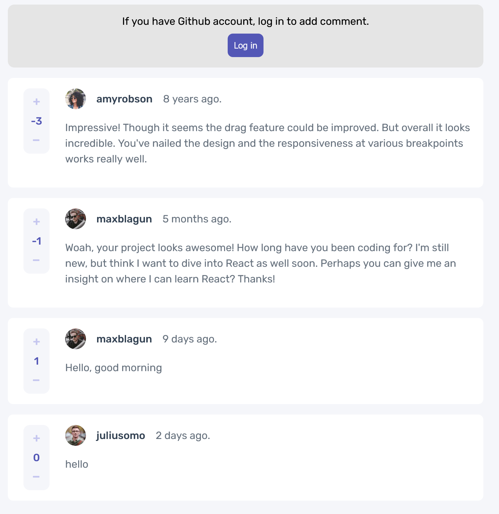

# Frontend Mentor - Interactive comments section solution

This is a solution to the [Interactive comments section challenge on Frontend Mentor](https://www.frontendmentor.io/challenges/interactive-comments-section-iG1RugEG9). Frontend Mentor challenges help you improve your coding skills by building realistic projects. 

## Table of contents

- [Overview](#overview)
  - [The challenge](#the-challenge)
  - [Screenshot](#screenshot)
  - [Links](#links)
- [My process](#my-process)
  - [Built with](#built-with)
  - [What I learned](#what-i-learned)
  - [Continued development](#continued-development)
  - [Useful resources](#useful-resources)
- [Author](#author)

## Overview

### The challenge

Users should be able to:

- View the optimal layout for the app depending on their device's screen size
- See hover states for all interactive elements on the page
- Create, Read, Update, and Delete comments and replies
- Upvote and downvote comments
- Use Github to log in

### Screenshot

### Links

- Live Site URL: [Vercel :: Interactive Comments Section](https://interactive-comments-section-sepia.vercel.app/)

## My process

### Built with

- Semantic HTML5 markup
- CSS custom properties
- Flexbox
- CSS Grid
- Mobile-first workflow
- [React](https://reactjs.org/) - JS library
- [Next.js](https://nextjs.org/) - React framework
- [SCSS](https://sass-lang.com/) - For styles
- [NextAuth](https://next-auth.js.org/) - For authentication
- [Mongodb - Atlas](https://www.mongodb.com/atlas/database) - For database

### What I learned

For this project, I decided to make it a fullstack app. I learned backend several years ago but have not built anything meaningful ever since. I just realized things become much easier than before because of all the tools available. I especially love NextAuth. It makes authentication become simple. I use Mongodb to refresh my memory on database.   

### Continued development

For future projects, I want to dig deeper into backend, especially NextAuth and Mongodb. I only used NextAuth's Github authentication on this project, but next time, I will try other providers. For Mongodb, next time, I will learn how to design schema and build a better database's api. I might learn a bit about GraphQL and other database systems. 

### Useful resources

- [Loading Screen](https://codepen.io/Sixclones/pen/VBdeXL) - I used one of the loading screens on this Codepen for my project.
- [Production Grade NextJS course](https://production-grade-nextjs.vercel.app) - This website is the learning material of Production Grade NextJS course from [FrontEnd Master](https://www.frontendmaster.com). This is where I discovered NextAuth.

## Author

- Website - [Minh Le](https://www.ledminh.dev)
- Frontend Mentor - [@ledminh](https://www.frontendmentor.io/profile/ledminh)
